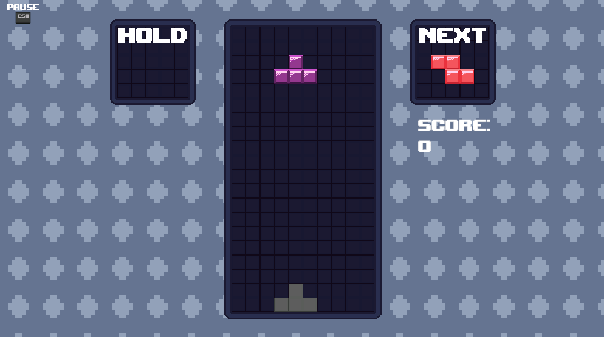

# 🎮 Tetris in Unity

A simple but polished Tetris clone built in Unity.

Originally based on a tutorial to understand core mechanics. I expanded it with original features like a settings menu, custom music, animated backgrounds, and artwork by a friend.

---

## ✨ Features

- 🎵 Background music with volume control
- ⚙️ Settings menu (volume)
- 🎨 Custom UI and art
- 🌌 Animated background
- 🧩 Core Tetris mechanics: line clear, rotation, speed-up

---

## 🛠️ Tech Stack

- **Engine:** Unity
- **Language:** C#
- **Tools:** Unity Editor, Asperite, Audacity

---

## 📸 Preview

> 

---

## 🚀 Getting Started

1. Clone the repo:
   ```bash
   git clone https://github.com/FunnyMartin/Tetris.git
